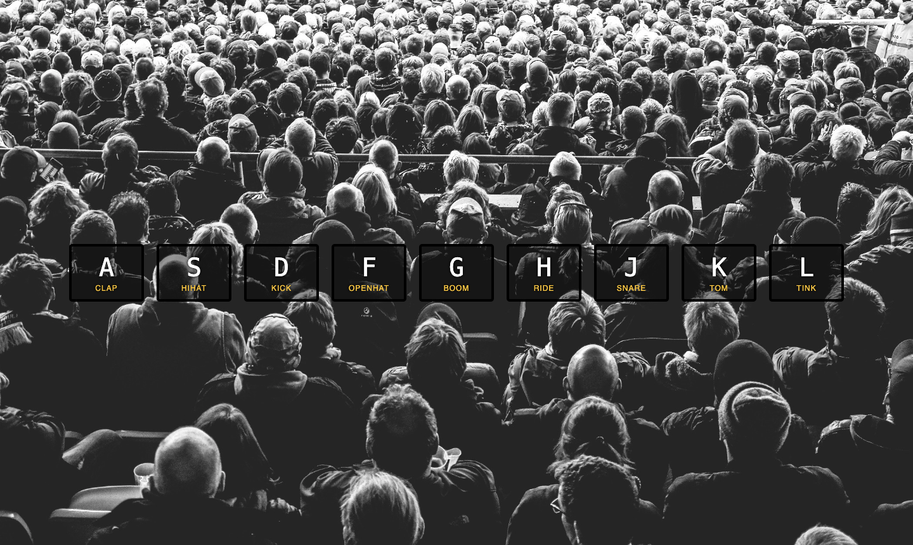

# Drum kit 
A Fancy web app where pressing keys triggers corresponding sounds. 
---

## Screenshot



## Links

URL: [drum kit](https://01-java-script-drum-kit-one.vercel.app/)

## Getting started

For starting this in your machine, open the terminal and follow these commands:

git clone the repo
```
git clone https://github.com/Vinayy-B/01-javaScript-drum-kit.git
```

cd into working directory
```
cd 01-javaScript-drum-kit
```

open http://localhost:5000 in browser to run.

